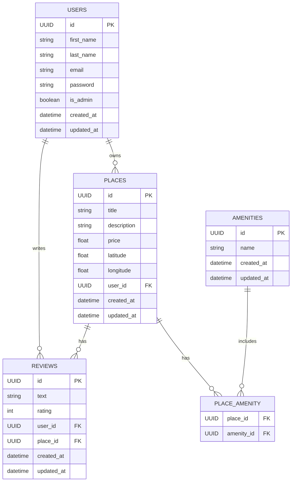

---

 

# ER Diagram – Explanation
 

## 1. Overview
 
This Entity-Relationship (ER) diagram represents the data model of the HBnB application, inspired by platforms like Airbnb.

It defines the core entities of the system and the relationships between them, allowing the application to manage:

- Users
- Places (properties)
- Reviews
- Amenities

The diagram ensures a clear separation of concerns and enforces data consistency through primary and foreign keys.

 

---  
 

## 2. Entities Description

### USERS
 
The USERS entity represents all registered users of the application.

Attributes:

id (PK): Unique identifier

first_name, last_name: User identity

email: User email (should be unique)

password: Hashed password

is_admin: Boolean indicating admin privileges

created_at, updated_at: Timestamps

Role:
A user can own places and write reviews.

 

---  
 

### PLACES
 
The PLACES entity represents properties listed by users.

Attributes:

id (PK): Unique identifier

title, description: Property details

price: Cost per stay

latitude, longitude: Location coordinates

user_id (FK): References the owner (USERS)

created_at, updated_at: Timestamps

Role:
A place belongs to one user and can have multiple reviews and amenities.

 

---

 

### REVIEWS
 
The REVIEWS entity represents feedback left by users on places.

Attributes:

id (PK): Unique identifier

text: Review content

rating: Numerical rating

user_id (FK): Author of the review

place_id (FK): Reviewed place

created_at, updated_at: Timestamps

Role:
A review links a user to a place.

 

---

 

### AMENITIES
 
The AMENITIES entity represents features available in places.

Attributes:

id (PK): Unique identifier

name: Name of the amenity

created_at, updated_at: Timestamps

Role:
Amenities can be shared across multiple places.

 

---

 

### PLACE_AMENITY
 
The PLACE_AMENITY table is a junction table used to model the many-to-many relationship between places and amenities.

Attributes:

place_id (FK): References PLACES

amenity_id (FK): References AMENITIES

Role:
Allows a place to have multiple amenities and an amenity to be associated with multiple places.

 

---

 

## 3. Relationships
 

### USERS → PLACES (One-to-Many)
 
A user can own multiple places.

A place belongs to exactly one user.
 

### USERS → REVIEWS (One-to-Many)
 
A user can write multiple reviews.

A review is written by one user.
 

### PLACES → REVIEWS (One-to-Many)
 
A place can have multiple reviews.

A review is associated with one place.
 

### PLACES ↔ AMENITIES (Many-to-Many)
 
A place can have multiple amenities.

An amenity can belong to multiple places.

This relationship is implemented via the PLACE_AMENITY table.

 

---

 

## 4. Data Integrity and Design Choices
 
All entities use a unique identifier (id) as a primary key.

Foreign keys enforce relationships between entities.

The many-to-many relationship is normalized using a junction table.

Timestamps (created_at, updated_at) allow tracking of data changes.

 

---

 

## 5. Conceptual Model Summary
 
This data model reflects the following logic:

Users interact with the system by creating places and writing reviews.

Places are owned by users and enriched with amenities.

Reviews connect users to places, representing user feedback.

 

---

 

## 6. Conclusion
 
This ER diagram provides a solid relational foundation for the HBnB application.
It ensures scalability, data consistency, and a clear mapping to future implementations using SQL databases and ORM tools such as SQLAlchemy.
 
Amenities are reusable and shared across multiple places.

6. Conclusion
 
This ER diagram provides a solid relational foundation for the HBnB application.
It ensures scalability, data consistency, and a clear mapping to future implementations using SQL databases and ORM tools such as SQLAlchemy.

 
